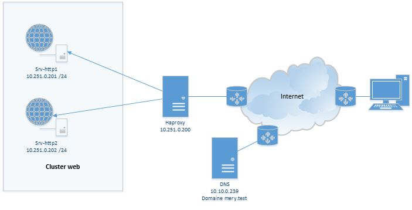
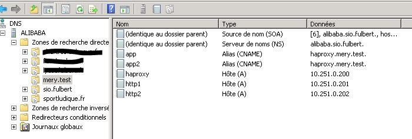
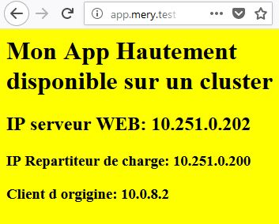
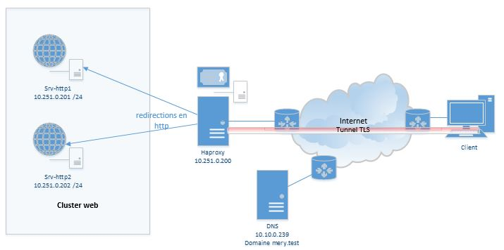
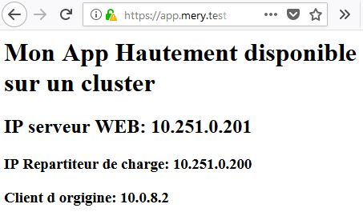
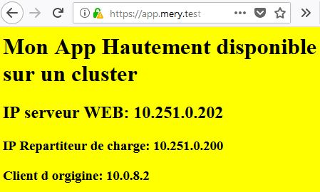
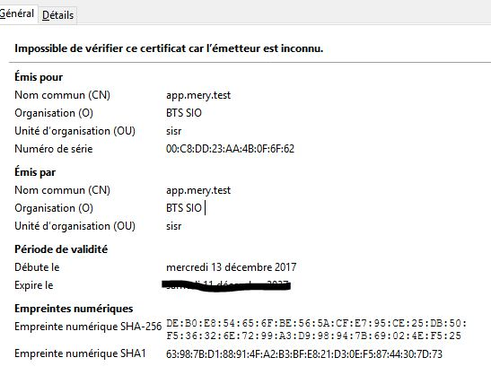

# 10 - LoadBalacing avec HA Proxy

## Introduction

L’objectif est de mettre en place de la répartition de charge sur une ou plusieurs application web.

Je ferai le test avec 2 serveurs web apache, en montrant les configurations nécessaires pour:

-   Du load Balancing d’une appli en http
-   Du Load Balancing d’une appli en https
-   Du Load Balabncing de plusieurs appli en http et https

## Configuration globale




## Configuration des serveurs DNS




-   Les deux serveurs sont enregistrés avec leurs IP respectives.
-   Le Load Balancer a aussi sont IP.
-   Les applications pointent vers le haproxy en utilisant des alias (enregistrements CNAME)

## Configuration du load Balancing d’une appli en http

Création d’un site web répondant au nom app.mery.test.

### Sur srv-http1

```bash
<html>
 <h1>Mon App Hautement disponible sur un cluster</h1>
<?php
echo "<h2>IP serveur WEB: ".$_SERVER['SERVER_ADDR']."</h2>";
echo "<h3>IP Repartiteur de charge: ".$_SERVER['REMOTE_ADDR']."</h3>";
echo "<h3>Client d orgigine: ".$_SERVER['HTTP_X_FORWARDED_FOR']."</h3>";
?>
</html>

```

N’oubliez pas d’activer le site web avec la commande a2ensite  à partir du fichier /etc/apache2/sites-avaibles/app.conf

### Sur srv-http2

La même chose sur srv-http2 en modifiant un peu le script (on va ajouter un fond en couleur)

```bash
<html>
<body style="background-color:yellow;">
 <h1>Mon App Hautement disponible sur un cluster</h1>
<?php
echo "<h2>IP serveur WEB: ".$_SERVER['SERVER_ADDR']."</h2>";
echo "<h3>IP Repartiteur de charge: ".$_SERVER['REMOTE_ADDR']."</h3>";
echo "<h3>Client d orgigine: ".$_SERVER['HTTP_X_FORWARDED_FOR']."</h3>";
?>
</body>
</html>
```

## Configuration de haproxy

```bash
listen cluster 0.0.0.0:80
    mode http      #mode http

    stats enable   #on active la gestion des stats ou pas
    
    stats uri /stats        #url d'accès a la consultation des stats
    stats realm Strictly\ Private   #accés restreint, authentification requise
    stats auth admin:admin          #utilisateur autorisé
    
    balance roundrobin      #Algorithme du tourniquet 50/50 pour 2 serveurs
    
    option httpclose        
    option forwardfor       #transmet au serveur le demandeur réél (le client)
    
    #on défini le cluster ici avec chaque adresse
    server srv-http1 10.251.0.201:80 check
    server srv-http2 10.251.0.202:80 check

```

On oublie pas de redémarrer le service




## Configuration du load Balancing d’une appli en https

Idem pour les serveurs web, rien à modifier

Il faut créer un tunnel entre le Client et le répartiteur de charge (haproxy), les serveurs web n’ont donc pas à être configurés avec TLS.



Il faut évidement un certificat valide pour le nom de domaine concerné, j’ai rapidement créé un certificat auto-signé.

!!! danger "Important"
    haproxy requiert l’usage du format pem qui regroupe dans un conteneur le certificat et la clé privée du serveur.
    Cela se fait en concaténant les deux fichiers dans un autre. Si vous le faites en ligne de commande utilisez la commande cat (listing du contenu du fichier par défaut sur l’écran) et surtout pas nano qui est un éditeur de texte.

```bash
cat lecertificat.crt lacleprive.key > app.mery.test.pem
```

## Configuration de HA Proxy

```bash
...
# on defini le point d'entré qui écoute en http et https
frontend appmerytest
        #on ecoute les 2 app sur les 2 ports
	bind app.mery.test:80
        # pour https (port 443) on précise le chemin
	bind app.mery.test:443 ssl crt /etc/ssl/app.mery.test/app.mery.test.pem
	
        #Pour forcer a utiliser https
        #redirect scheme https code 301 if !{ ssl_fc }

	mode http
	reqadd X-Forwarded-Proto:\ http
	reqadd X-Forwarded-Proto:\ https

        #on precise l'etiquette on sont définit les serveurs de backend (cachés)
	default_backend appmerytest_http_backend

#Définition du cluster backend (cachés des clients en opposition au frontend)
backend appmerytest_http_backend
	mode http
	
	balance roundrobin
	
        option forwardfor
	
        # redirection sur les serveurs en http
	server srv-http1 10.251.0.201:80 check
	server srv-http2 10.251.0.202:80 check
```








## Configuration du Load Balabncing de plusieurs applis en http et https

On crée une deuxième web-application sur chaque serveur web (app2) et on les active. (gestion des vhosts )

La deuxième version de l’application aura un fond vert plutôt que jaune sur le serveur http2 (ben oui c’est la même application que j’ai copié)

```bash
frontend appmerytest
	bind app.mery.test:80
	bind app.mery.test:443 ssl crt /etc/ssl/app.mery.test/app.mery.test.pem
	
	#redirect scheme https code 301 if !{ ssl_fc }
	mode http
	reqadd X-Forwarded-Proto:\ http
	reqadd X-Forwarded-Proto:\ https
	
	default_backend appmerytest_http_backend
	
frontend app2merytest
	bind app2.mery.test:80
	bind app2.mery.test:443 ssl crt /etc/ssl/app2.mery.test/app2.mery.test.pem
	
	#redirect scheme https code 301 if !{ ssl_fc }
	mode http
	reqadd X-Forwarded-Proto:\ http
	reqadd X-Forwarded-Proto:\ https
	
	default_backend appmerytest_http_backend

backend appmerytest_http_backend
	mode http
	balance roundrobin
	server srv-http1 10.251.0.201:80 check
	server srv-http2 10.251.0.202:80 check
```

Il y a ici deux expositions en FrontEnd avec chacune leurs certificats. La redirection se fait sur le même cluster de serveurs web (backend)


