# 13 Portail Captif avec Stormshield

## Introduction

Un portail captif est une page web qui s'affiche automatiquement lorsqu'un utilisateur se connecte à un réseau public ou restreint (en general en Wi-FI). Il oblige l'utilisateur à s'authentifier, accepter des conditions d'utilisation ou effectuer une action spécifique (comme entrer un code, payer un accès, ou s'inscrire) avant de pouvoir accéder à Internet.

## Pourquoi est-ce nécessaire légalement ?

En France et dans de nombreux pays, un opérateur de réseau public (y compris les entreprises, écoles, cafés, hôtels) est tenu de conserver un journal des connexions (logs) pour des raisons de traçabilité et de cybersécurité. Ces obligations sont encadrées par des lois comme :

- La loi anti-terrorisme et la loi HADOPI en France, qui exigent que l'accès Internet public ne soit pas anonyme.
- Le RGPD, qui impose d'informer les utilisateurs sur la collecte de leurs données et d'obtenir leur consentement.
- Le Code des postes et communications électroniques, qui tient le fournisseur d'accès responsable si son réseau est utilisé pour des activités illégales.

## Implémentation avec Stormshield

Stormshield prévoit trois modes d’authentification via un portail captif pour la gestion des accès invités :

### Mode Guest (Autoregistration)

- L’utilisateur s’inscrit lui-même via le portail captif en renseignant ses informations (nom, email, etc.). Cela est paramétrable.
- Un administrateur peut valider la demande ou l'accès peut être automatique après inscription.
- Utile pour les visiteurs occasionnels dans une entreprise ou un établissement public.

### Mode Vouchers (Comptes Temporaires)

- L’accès est basé sur des codes d’accès temporaires (vouchers) générés par un administrateur.
- Chaque code peut être limité en durée et en nombre d’utilisations.
- Adapté aux événements, conférences, ou accès temporaires pour des clients.

### Mode Parrainage (Sponsoring)

- Un utilisateur déjà authentifié (employé, responsable, etc.) doit valider la demande d’accès d’un invité.
- Permet un contrôle plus strict, car un sponsor est responsable de l’accès accordé.
- Idéal pour les entreprises souhaitant une traçabilité accrue des connexions des visiteurs.

La manière de configurer le portail captif est toujours similaire.

## Présentation de la maquette

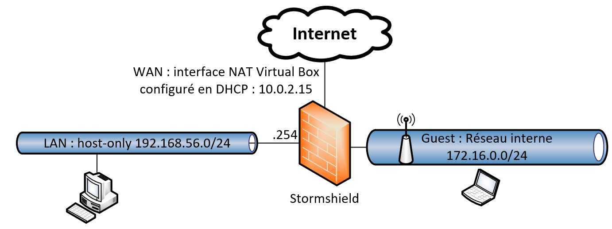

## Gestion d'un réseau Guest

1. Activer la méthode "Invités" :

- Accédez au module **Configuration > Utilisateurs > Authentification**.​
- Dans l'onglet Méthodes disponibles, ajoutez ou activez la méthode Invités.​
- Définissez la fréquence d'affichage des conditions d'utilisation de l'accès à Internet selon vos besoins. ​

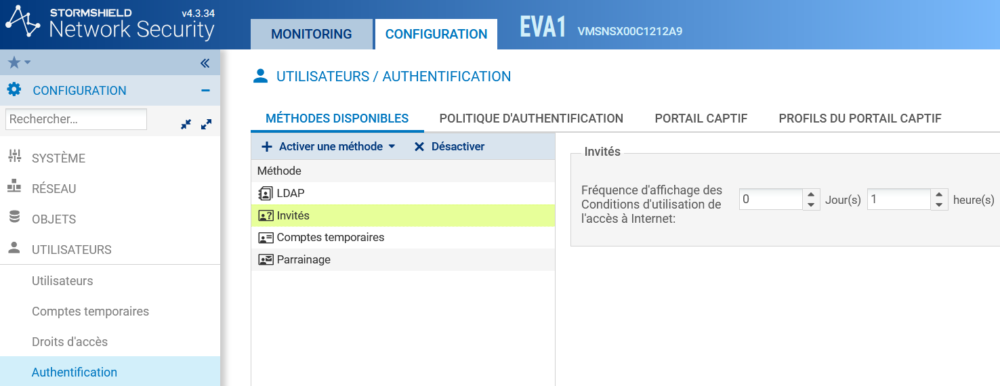

2. Créer une règle dans la politique d'authentification :

- Toujours dans le module **Configuration > Utilisateurs > Authentification**, allez à l'onglet Politique d'authentification.​
- Ajoutez une nouvelle règle en sélectionnant Règle Invités.​
- Spécifiez les interfaces par lesquelles les utilisateurs invités peuvent se connecter. ​

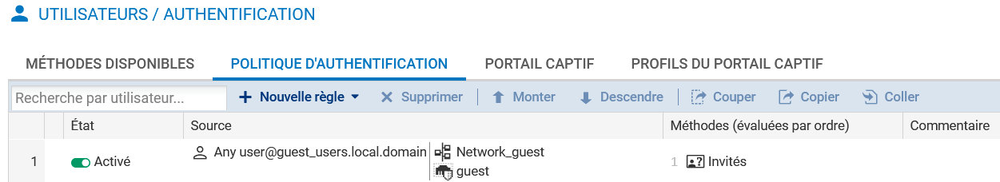

3. Personnaliser un profil de portail captif pour la méthode "Invités" :

- Dans l'onglet Profils du portail captif du module **Configuration > Utilisateurs > Authentification**, sélectionnez le profil Guest.​
- Ce profil est préconfiguré avec les paramètres nécessaires, tels que la méthode d'authentification par défaut et l'activation des conditions d'utilisation de l'accès à Internet.​
- Vous pouvez personnaliser les champs supplémentaires (par exemple, E-mail) que l'utilisateur invité pourra remplir avant d'accepter les conditions d'accès. ​

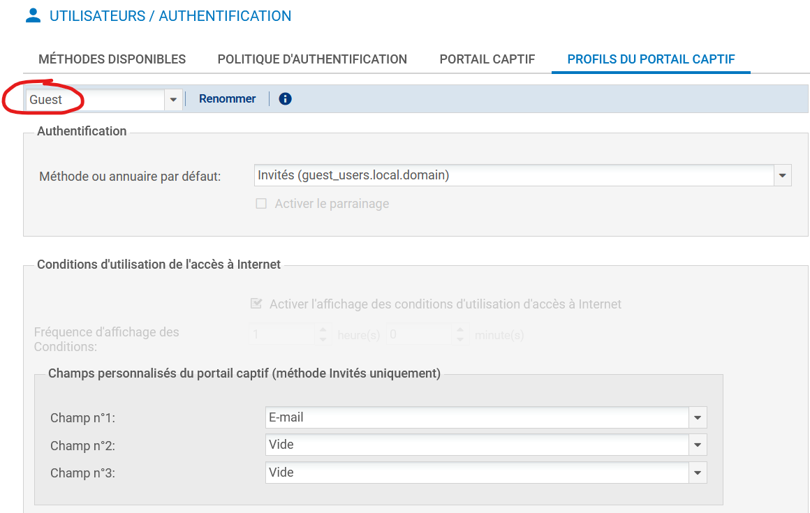

4. Associer le profil du portail captif aux interfaces réseau concernées :

- Dans l'onglet Portail captif du module **Configuration > Utilisateurs > Authentification**, ajoutez une correspondance entre l'interface réseau souhaitée et le profil Guest.​
- La méthode et l'annuaire associés à ce profil seront automatiquement renseignés. ​
- Adapter la politique de filtrage pour les utilisateurs invités :

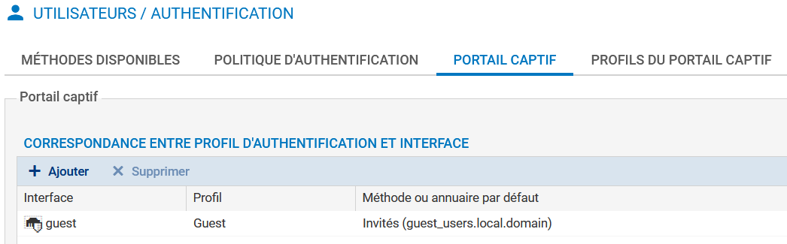

5. Créer une règle de redirection vers le portail captif :

- Dans **Configuration > Politique de sécurité > Filtrage et NAT**, ajoutez une nouvelle règle d'authentification.
- Définissez les sources et destinations pour lesquelles les utilisateurs non authentifiés seront redirigés vers le portail captif.
- Ajoutez les ports HTTP et HTTPS comme ports de destination.

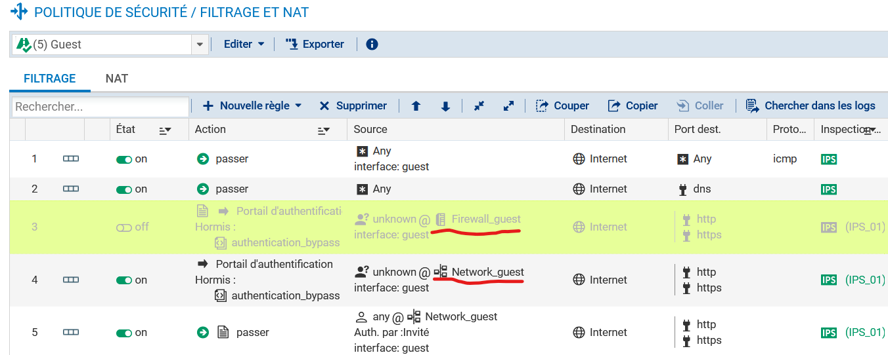

!!! danger "Information très importante "
    Attention: Ne pas se tromper de type d'objets: C'est bien les utilisateurs "Inconnus / unknow" du "réseau guest" (règle 4) et non de l'interface "FirewallGuest" (règle 3 désactivé sur la co^pie d'écran).

- Un client doit alors pouvoir se connecté et être invité à s'authentifié via le portail captif:

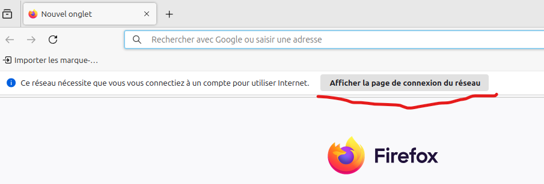

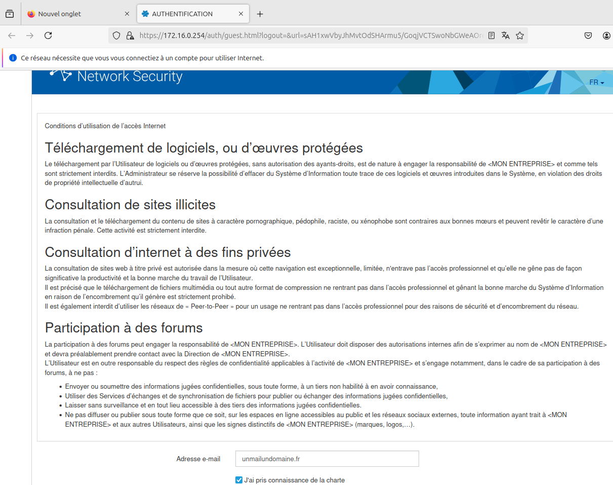

6. Consulter les journaux de traces :

- Les informations relatives aux connexions des utilisateurs invités, y compris les éventuels champs supplémentaires renseignés, sont enregistrées dans les journaux de traces du pare-feu.​
- Vous pouvez consulter ces journaux pour surveiller et analyser l'activité des utilisateurs invités.

!!! danger "Information très importante "
    Attention: Par respect du RGPD, les logs sont anonymisés, il faut demandé un accès complet au logs si on utilise un compte habilité.

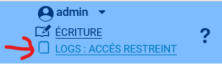 ​

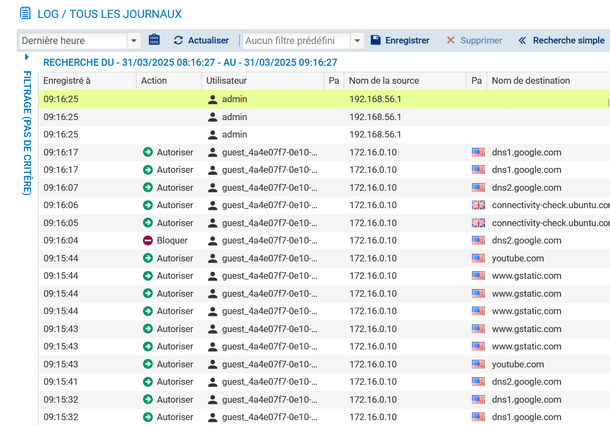 ​

On peut retrouver les champs saisi dans le formulaire via **Monitoring > Utilisateurs**
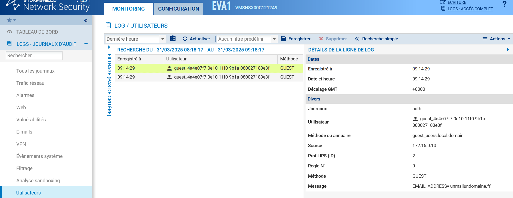 ​

Un clic droit sur l'utilisateur permet de le deconnecter
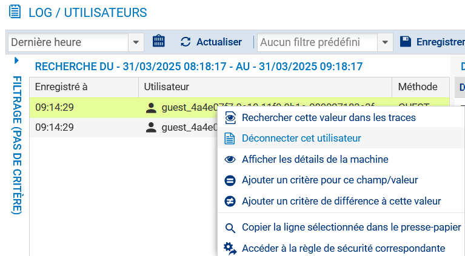 ​

