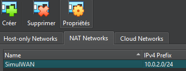
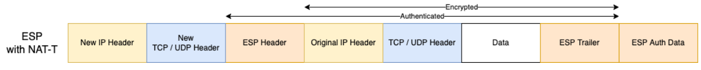

# 14 VPN IPSec - site à site

## Qu'est-ce qu'un VPN Site à site

Un VPN site-à-site est un type de connexion qui permet de relier deux réseaux distants via un tunnel sécurisé sur Internet. Contrairement à un VPN client-serveur, où un utilisateur individuel se connecte à un réseau distant, un VPN site-à-site permet à deux réseaux (par exemple, deux bureaux d'une entreprise) de se connecter entre eux, comme s'ils étaient directement reliés par un câble, mais de manière sécurisée à travers Internet.

## Les 2 Phases nécessaires dans un VPN Site-à-Site avec IKEv2

### Phase 1 : Établissement du tunnel sécurisé (IKE SA)

-  **But** : La phase 1 permet de négocier et de sécuriser la communication entre les deux sites. Cela consiste principalement à établir un tunnel IKE (Internet Key Exchange) sécurisé, appelé SA (Security Association).

-  **Processus** :
   -   Les deux sites échangent des informations pour s'authentifier mutuellement (par exemple, via des certificats ou des clés pré-partagées).
   -   Les paramètres cryptographiques sont négociés, comme les algorithmes de chiffrement et d'intégrité.
   -   Une fois l'authentification et la négociation des algorithmes réussies, un tunnel sécurisé est établi.
   -   Protocoles utilisés : **isakmp** (Internet Security Association and Key Management Protocol) via l'implémentation **IKEv2** (Internet Key Exchange version 2), qui est un protocole très sécurisé et rapide pour la négociation des clés.

### Phase 2 : Négociation du tunnel de données (IPsec SA)

-   **But** : La phase 2 permet de sécuriser le tunnel de données réel qui sera utilisé pour le transfert des informations entre les deux sites. Cela se fait en négociant une SA IPsec.
-  **Processus** :
    -   Les deux sites négocient les paramètres du tunnel IPsec (par exemple, le type de chiffrement, la durée de vie de la session, etc.).
    -   Une fois cette négociation terminée, les données chiffrées sont envoyées via ce tunnel sécurisé.
    -   La phase 2 ne touche pas à l'authentification, elle se base sur les clés générées durant la phase 1.
    -   Protocoles utilisés : Encapsulating Security Payload (Paquet type ESP code 50) 

!!! info "A comprendre"
    ESP (Encapsulating Security Payload) est un protocole de la couche réseau (Layer 3 - IP).
    On parle donc de Paquets IP même s'il y a il y a bien une en-tête IP avant ESP, mais cela ne change pas le fait que ESP encapsule un paquet IP (le payload chiffré).
    
    Paquet IP classique avec un segment TCP en couche 4:
    ````
    [ En-tête IP ] - [ En-tête TCP ] - [ Données ]
    ````

    Paquet ESP
    ````
    [ En-tête IP externe ] - [ En-tête ESP ] - [ Paquet IP original chiffré avec le segment TCP et les data ] - [ Authentification ESP ]
    ````


## Exemple simple

Voici un exemple de maquette implémentée avec VirtualBox

-   le réseau WAN entre les firewalls (pfsense) est simulé avec le réseau NAT-Network de virtualBox qu'il faut penser à créer. Il aura un adressage privé (10.0.2.0/24, GW: 10.0.2.1).
-   les 2 Firewalls pfsense disposeront d'une interface LAN sur un réseau host-only dédié. Sous windows le réseau host-oncly par défaut est dans le réseau 192.168.56.0/24. Pensez a ajouter un second réseau.

### Gestion des réseaux sous VirtualBox





!!! danger "Remarque très importante"
    Vous penserez à ne pas bloquer les adresses RFC 1918 sur vos interface WAN des 2 Firewalls: c'est activé par défaut et rendra la communication impossible !


### Configuration IPSec Phase 1

Vérifier vos communications réseau avec des requètes ICMP ping et mettez les règles de Firewall si nécessaire.

Sur chacun des firewalls (pfsense) , Dans VPN / IPSEC

Créer un nouveau Tunnel

-  Choisir IKEv2
-  Interface: Votre interface WAN
-  Paserelle Distante: l'adresse IP WAN du routeur distant

L'authentification reposera dans un premier temps sur une clé prépartagée

-  MyIdentifier: Votre IP WAN
-  PeerIdentifier: l'IP WAN distante

Vous disposez d'un bouton de génération automatique de clé: Pratique, mais bien penser à la copier/coller sur le second firewall: **les clés doivent être identiques**.

-   Algorithmes:
    -   Chiffrement : AES256-GCM   clé de 128 bits, 
    -   Hash: SHA256 
    -   Diffie-Hellman Group: 14 (2048 bits)

-  Laisser le reste des champs par défaut
-  Activier le DeadPeer Detection (DPD) pour maintenir le Tunnel actif.

### Configuration IPSec Phase 2

Ajouter une phase 2

-   Precisez les réseaux locaux (LAN) et distant.
chez moi: 192.168.56.0/24 et 192.16.113.0/24 

-   SA KeyExchange: Protocol ESP
-   Algorithmes: AES, AES 128GCM, ajoutez AES256-GCM (ikev2 seulement)
-   Vous pouvez ajoutez un ping automatique pour joindre l'interface LAN du FW distant pour générer du trafic dans le Tunnel.

## Situation 2 - NAT-T

L'objectif ici est de traverser des routeurs frontaux aux Firewalls.
Les paquets ESP sont de couche 3 et ne traversent donc pas les routeurs.
Il faut encapsuler nos pacquets dans des segments UDP sur le port 4500.


le réseaux entre chaque firewall et son routeur est un réseau **"Internal"** sous VirtualBox.

### Structure des paquets

Voici un Pacquet ESP qui contient des données chiffrées : Le Payload est un paquet TCP ou UDP qui est encapsulé dans un pacquet ESP.


Pour pouvoir traverser un (ou plusieurs) routeur qui fait du NAT, les paquets ESP doivent eux même etre réencapsulés dans des paquets UDP/4500 : c'est le **NAT-Traversal**



### Configuration des routeurs (linux Debian 12)

Sur chacun des routeurs:

-   Reperer votre interface "wan" (enp0s3 pour moi).

#### Configurer le NAT et la redirection de port:

Il faut faire une redirection des port UDP 500 et 4500 vers chacun des Firewalls.
Sous Debian 12, iptable a été remplacé par son successeur nftable.
Pour prendre en compte le Nat il suffit d'installer UFW (Uncomplicated Firewall).

!!! danger "Attention"
    UFW est pratique dans le cadre d'un usage "classique".
    Des règles par défaut sont implémentées et ne sont pas forcement compatible avec le VPN même après avoir ouvert les ports concernés (j'enquête encore dessus). La solution la plus simple sera de désactiver UFW

````bash
sudo nano /etc/nftables.conf

##ajouter ces lignes a la fin pour configurer le NAT et la redirection de port en adaptant bien evidement (ici je suis sur le routeur B)
table ip nat {
        chain postrouting {
                type nat hook postrouting priority srcnat; policy accept;
                oifname "enp0s3" masquerade
        }

        chain prerouting {
            type nat hook prerouting priority filter; policy accept;
            iifname "enp0s3" udp dport 500 dnat to 172.16.20.1:500
            iifname "enp0s3" udp dport 4500 dnat to 172.16.20.1:4500
        }
}
````

!!! danger "Ne pas oublier de désactiver le Firewall"
    On désactive UFW pour éviter des effets de bords indésirables

````bash
sudo ufw disable
````

### Adapter la configuration du VPN

Pensez à spécifier explicitement les adresses "publiques" pour l'authentification en pensant qu'on est derrière un routeur. Il faut donc bien mettre les IP Publiques (ici simulées en 10.0.2.0/24)


Pensez à verifier vos règles de filtrage.


En cas de probleme ne pas hesitez à mettre une VM dans le réseau WAN en promiscuité pour écouter les différents échanges. Les IP "source" et "destination" doivent être les IP d'extremitées publiques sans quoi le tunnel ne montera jamais.

### Diagramme de séquence

Voila le résumé des échanges entre les 2 parefeux

-  IKE_SA_INIT : échange pour négocier les paramètres de sécurité (algorithme de chiffrement pour la confidentialité, fonction de hachage pour l’intégrité, fonction pseudo-aléatoire ou Pseudo-Random Function pour dériver les clés de chiffrement à partir de la négociation initiale, groupe et valeur DH pour l’échange de clés initial, nonce pour éviter le rejeu des valeurs cryptographiques calculées).
-  IKE_AUTH : échange pour transmettre les identités et création de la première SA ESP.
-  INFORMATIONAL : échange pour vérifier la continuitié d’une SA, supprimer des SA, reporter des erreurs, etc.
-  CREATE_CHILD_SA : échange pour créer des SA ESP supplémentaires. 


Un filtre adapté sur wireshark pour pouvoir les analyser:

````bash
udp.port==500 or udp.port==4500 or ESP
````


!!! info "Remarque"
    Il faut evidement être plus restrictif sur les sources et destination dans le monde réel.

!!! danger "Problème courant"
    Simuler un routeur avec un noyeau Linux peut être laborieux, normallement avec vos routeurs Cisco vous devriez être moins embetté et ne pas avoir à gérer les règles nftable remplacant iptable

