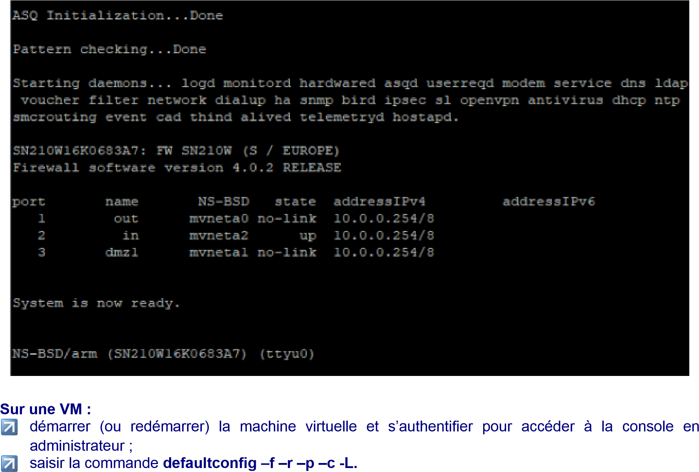
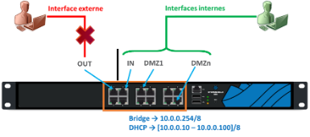
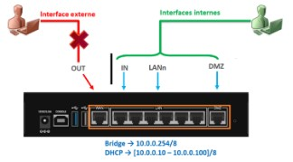
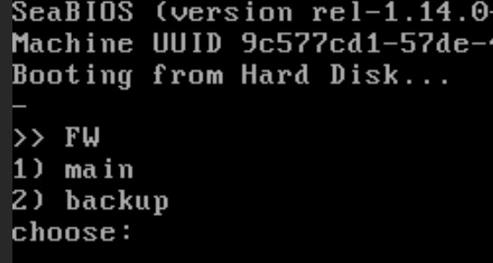
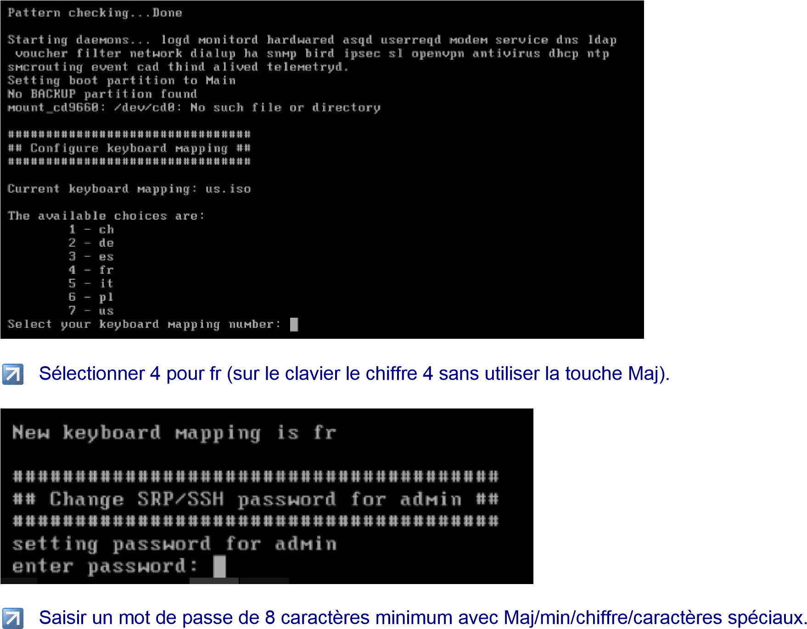
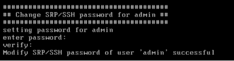
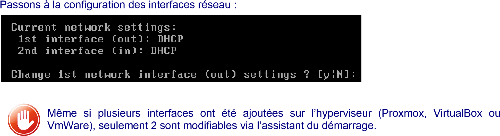
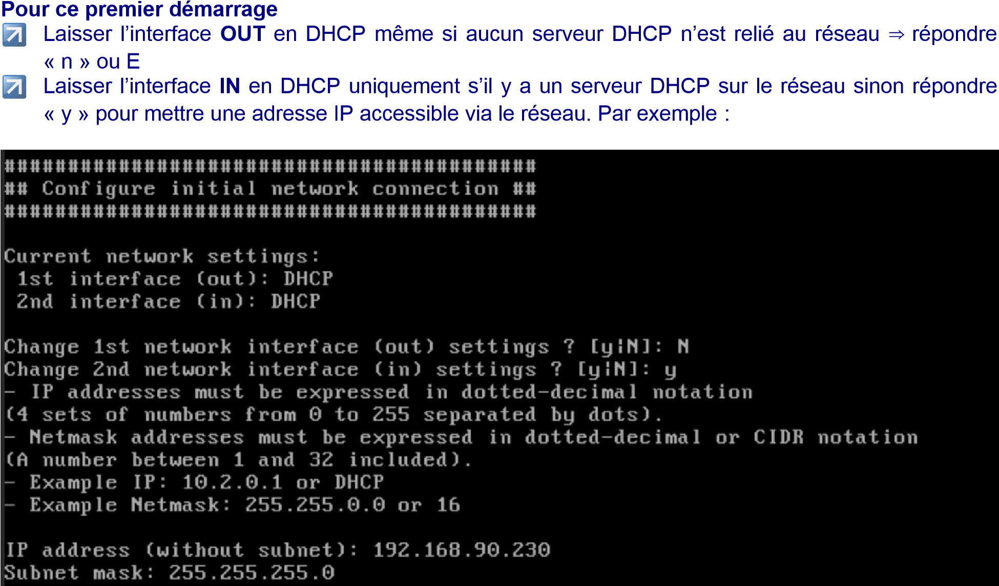
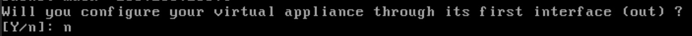
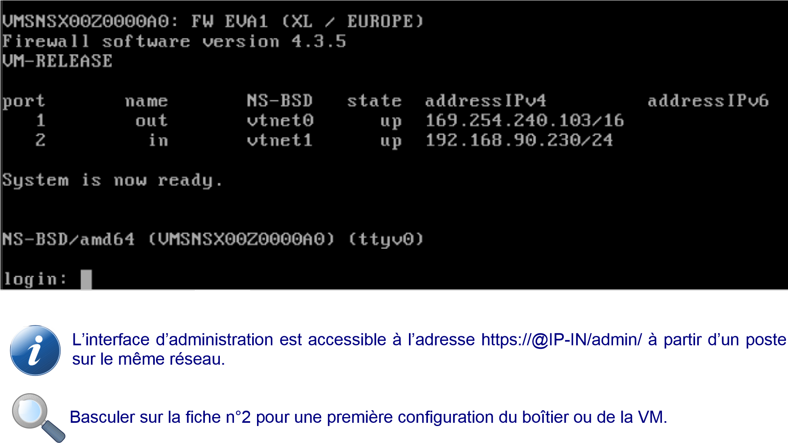

# Fiche 1 - Initialiser un Pare-feu SNS

## Procédure de remise à zéro des pare-feu SNS

** Cette procédure ne doit évidemment être déroulée que sur un SNS qui
aurait déjà été configuré.**

Un RAZ du pare-feu peut être fait via la console (sur les VM ou les
boitiers physiques), ceci nécessite un redémarrage (reboot). **Sur les
boîtiers physiques** : un appui sur le bouton *reset* pour les boîtiers
physiques permet de restaurer la configuration d'usine et redémarrer en
bridge sur toutes les interfaces.

Vous pouvez faire le choix de réinitialiser un boitier physique via
l'accès console. Pour cela, installer le driver du câble console sur
Windows[^1] :
[[https://ftdichip.com/drivers/vcp-drivers/]{.underline}](https://ftdichip.com/drivers/vcp-drivers/).
Lancer un logiciel permettant l'accès console (Putty, Teraterm, minicom)
et utilisant en débit **115200**.

> {width="6.476667760279965in"
> height="4.373334426946632in"}
>
> **Pour installer le pare-feu sur une KVM de Proxmox,** suivre la fiche
> « Installer une VM SNS sur Proxmox » (fichier
> installerSNSsurProxmox.pdf).
>
> **Pour installer le pare-feu sur VirtualBox ou vmWare**, suivre la
> documentation de Stormshield.
>
> Sur une VM, faire en sorte qu'une des interfaces « in » se trouve
> connectée à un réseau logique sur lequel est également connecté (ou
> peut être connecté) un poste de travail permettant de procéder à la
> première configuration.

# Configuration initiale

La configuration d'usine par défaut du *pare-feu SNS* (boîtier ou
appliance VM laboratoire) est la suivante. Dans une configuration usine,
notamment pour les machines virtuelles et les modèles SN310, la première
interface **(1)** du pare-feu SNS physique est nommée « **OUT »**, la
seconde « IN » et le reste des interfaces « DMZx ». L'interface « OUT »
est une interface **externe**, utilisée pour connecter le pare-feu SNS à
internet et le reste des interfaces sont **internes** et servent
principalement à connecter le pare-feu SNS à des réseaux locaux.

{width="0.4266666666666667in"
height="0.5166666666666667in"}La distinction interne/externe pour les
interfaces permet de se protéger contre les attaques d'usurpation
d'adresse IP.

> {width="4.010416666666667in"
> height="1.78125in"}

Le schéma présenté ci-dessous correspond, quant à lui, à un boîtier
SN210. Comme vous pouvez le constater, l'organisation des interfaces est
différente de celle des machines virtuelles ou des modèles SN310 et
supérieur.

> {width="3.375in"
> height="1.8645833333333333in"}

Pour initialiser le pare-feu, il faut se brancher sur l'interface « IN
».

En configuration usine, sur un **boîtier physique** de type SN210 ou
SN310, **toutes les interfaces sont incluses dans un bridge** dont
l'adresse est 10.0.0.254/8. Sur les **boîtiers** **physiques**, un
serveur DHCP est actif sur toutes les interfaces du bridge et il
distribue des adresses IP comprises entre 10.0.0.10 et 10.0.0.100.
L'accès à l'interface web de configuration du pare-feu SNS se fait avec
l'url : **https://10.0.0.254/admin.**

**Sur le boîtier**

Par défaut, seul le compte système **admin** (mot de passe par défaut
**admin**), disposant de tous les privilèges sur le boîtier, existe et
peut se connecter.

**Sur une VM**

La configuration usine lance un dialogue de pré-configuration qui
demande de changer le mot de passe par défaut, de configurer vos
interfaces, le clavier de la console, etc :

Un premier écran propose un choix qu'il n'est pas nécessaire de valider,
le système continue automatiquement :
{width="2.047222222222222in"
height="1.0916666666666666in"}

Un premier redémarrage automatique est fait et la configuration continue
:

{width="5.860001093613298in"
height="4.573333333333333in"}

Pour éviter les soucis de clavier américain sur certaines consoles
d'hyperviseur, utilisez par exemple Sio2022\* puis confirmez.

{width="5.0in"
height="1.3020833333333333in"}

> {width="6.470001093613298in"
> height="1.7666666666666666in"}

Les interfaces peuvent être laissées en DHCP ou être configurées via une
adresse IP fixe.

> {width="0.44in"
> height="0.38999890638670165in"}Sachant qu'il est déconseillé
> d'administrer le pare-feu via l'interface OUT, l'idée est de
> configurer l'interface **IN** de manière à ce qu'elle se trouve
> connectée à un réseau logique sur lequel est également connecté (ou
> peut être connecté) un poste de travail permettant de procéder à
> l'administration du Stormshield.

*Lors de cette configuration, le paramétrage pourra être, bien sûr,
modifiée et, par exemple, une autre interface pourra être dédiée à
l'administration.*

{width="6.5in" height="3.81in"}

Répondre « n » sur la dernière question, en effet il n'est pas
recommandé d'autoriser l'administration sur votre interface **OUT**.

{width="6.495834426946631in"
height="0.3451388888888889in"}

Votre système est installé avec les valeurs rappelées ci-dessus, vous
pouvez tester que la configuration du clavier a bien été prise en compte
en saisissant votre login/mdp.

{width="6.5in"
height="3.6533333333333333in"}

[^1]: https://documentation.stormshield.eu/SNS/v4/fr/Content/Software_Recovery_via_USB_key/SN150SN160-SN160W-SN210-SN210W-SN310.htm
