# Fiche 12 -- VPN

## Le VPN SSL

Les pare-feux Stormshield intègrent deux types de VPN SSL qui peuvent
être utilisés simultanément :

-   VPN SSL portail qui permet l'accès aux serveurs Web HTTP et serveurs
    applicatifs via le portail captif après authentification.
-   VPN SSL (complet) qui permet l'accès au réseau interne d'une manière
    transparente.

La fiche ne concerne que le VPN SSL en mode complet.

### Concepts et généralités


Le VPN SSL permet à des utilisateurs distants d'accéder
de manière sécurisée aux ressources internes d'une entreprise. Les
communications entre l'utilisateur distant et le pare-feu sont
encapsulées et protégées via un tunnel TLS chiffré. L'établissement de
ce tunnel est basé sur la présentation de certificats serveur et client
signés par une autorité de confiance (CA). Cette solution garantit donc
authentification, confidentialité, intégrité et non-répudiation.

Au niveau du pare-feu, les tunnels VPN SSL sont gérés par le serveur
OpenVPN (logiciel libre) qui est intégré dans le firmware en tant que
nouveau service. OpenVPN peut fonctionner sur n'importe quel port TCP
(par défaut 443) et/ou UDP (par défaut 1194), à l'exception de
quelques-uns, qui sont utilisés pour les processus internes du pare-feu.

Le fonctionnement sur le port TCP 443 offre un accès aisé depuis les
réseaux avec filtrage d'accès à Internet (hôtels, wifi public, connexion
3G, etc.).

En ce qui concerne les utilisateurs nomades, le tunnel est géré par le
client VPN SSL (Stormshield ou openVPN standard), qui doit être installé
et configuré sur les machines. Ce client est installable sur tout type
de terminal (Windows, IOS, Android, etc.). Les différents éléments de
configuration (certificats, fichier de conf, etc.) sont récupérés sur le
portail captif. Une fois le tunnel mis en œuvre, l\'hôte distant
récupère une adresse IP fournie par le serveur VPN SSL. Elle sera
considérée comme faisant partie des réseaux internes (protégés) du
pare-feu et l'utilisateur sera vu comme authentifié.

La mise en œuvre du tunnel VPN SSL s'effectue en trois étapes
principales :

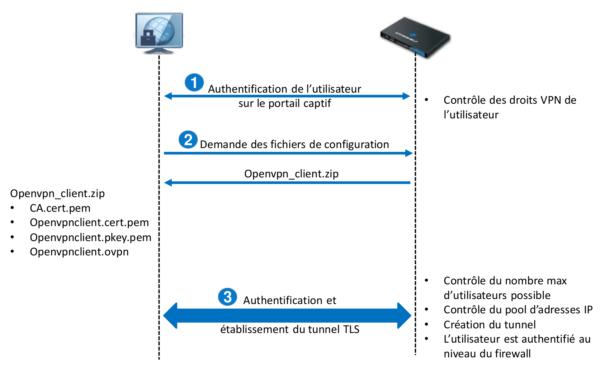

1. Le client VPN SSL authentifie l'utilisateur via le portail captif.
Durant cette étape, le pare-feu vérifie si l'utilisateur authentifié
possède les droits lui permettant d'ouvrir un tunnel VPN SSL.

2. Si l'authentification réussit, le client envoie une requête pour
récupérer les fichiers de configuration renvoyés par le pare-feu dans un
dossier compressé « openvpn_client.zip ». Le dossier contient les
fichiers suivants :

    -   Le certificat de l'autorité de certification (CA.cert.pem),
    -   Le certificat du client et sa clé privée (openvpnclient.cert.pem et
        openvpnclient.pkey.pem),
    -   La configuration du client OpenVPN.

3. Le client lance le processus de mise en œuvre du tunnel TLS avec
authentification par certificat à l\'aide des certificats récupérés lors
de l'étape précédente. Avant la mise en œuvre du tunnel, le pare-feu
vérifie que le nombre maximal d'utilisateurs n'est pas encore atteint et
qu'un sous-réseau peut être réservé pour ce nouveau client. Si toutes
les conditions sont vérifiées, le tunnel est mis en œuvre et
l'utilisateur est considéré comme authentifié.

!!! Warning  "Info"
    Si le serveur VPN SSL est accessible via un port UDP ou TCP, le client
    VPN SSL tente d'abord de mettre en œuvre le tunnel avec le protocole
    UDP et en cas d'échec, il effectue automatiquement une nouvelle
    tentative avec le protocole TCP.

### Configurer le service VPN SSL

Préalables

La première étape de mise en œuvre d'un tunnel VPN SSL est
l'authentification de l'utilisateur via le portail captif, ce qui
signifie :

-   qu'un annuaire externe ou interne doit être configuré au niveau du
    pare-feu (voir fiche 10) ;

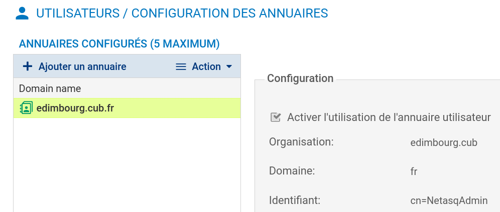

-   qu'une méthode d'authentification doit être configurée :

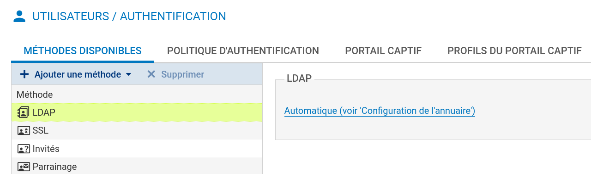

-   qu'un profil du portail captif doit être rattaché à l'interface
    depuis laquelle les utilisateurs se connectent :

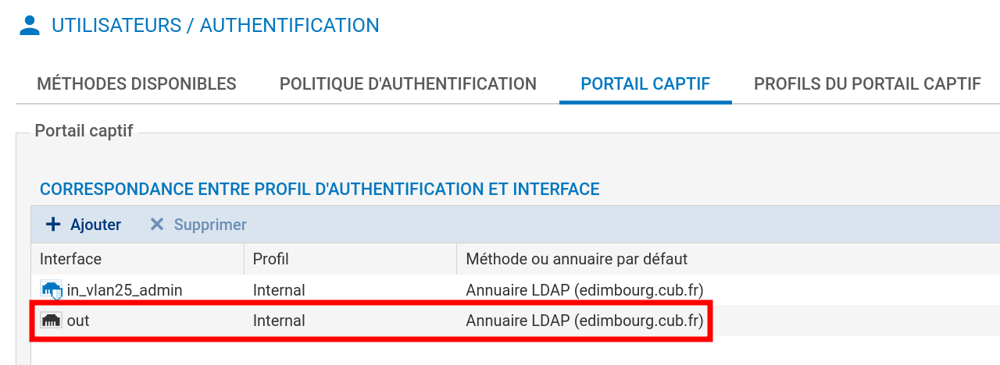

Les méthodes d'authentification possibles pour le service VPN SSL sont
les méthodes explicites qui nécessitent un couple identifiant/mot de
passe, en l'occurrence LDAP (interne, externe ou Microsoft Active
Directory), Kerberos et Radius.

Des certificats seront utilisés pour l'authentification entre le client
et le serveur VPN SSL. Pour cela, une autorité de certification racine
(CA) existe dans la configuration usine de tous les pare-feux
Stormshield Network. Cette CA est nommée sslvpn-full-default-authority,
et elle contient un certificat serveur (qui identifie le serveur VPN
SSL), et un certificat client (qui identifie tous les clients : chacun
d'entre eux sera ensuite différencié par un couple login/mot de passe).


Configuration du serveur SSL

-   Cliquer sur le module **Configuration** \> **VPN** \> **VPN SSL** et
    activer le **Activer le VPN SSL**.

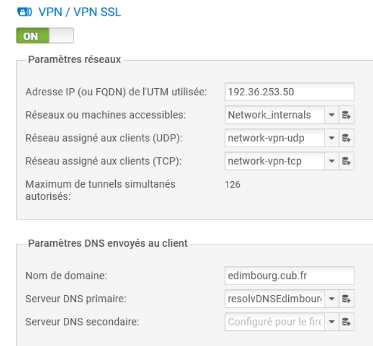

Paramètres réseaux

-   Indiquer l'adresse IP ou le FQDN pour lequel le pare-feu Stormshield
    Network sera joignable pour établir les tunnels VPN SSL. Ce doit
    être une adresse IP publique (accessible sur Internet) ou une
    adresse IP privée accessible via une redirection.

-   Dans le champ **Réseaux ou machines accessibles**, sélectionner ou
    créer l'objet représentant les réseaux et/ou machines qui seront
    joignables au travers du tunnel SSL. Cet objet peut être un réseau,
    une machine ou un groupe incluant des réseaux et / ou des machines.

!!! Warning   "Info"
    Il sera nécessaire de définir les routes nécessaires
    pour joindre l'ensemble des ressources et d'affiner les règles de
    filtrage.

-   Paramètres DNS envoyés au client

-    Indiquer le suffixe DNS qui sera utilisé par les clients pour réaliser
leurs résolutions de noms d'hôtes.

-    Préciser les serveurs DNS primaire et secondaire à lui attribuer.

!!! Danger   "Important"
    **Les réseaux assignés aux clients UDP et TCP doivent
    être différents. **Choisir des réseaux entièrement dédiés aux clients
    VPN SSL et n'appartenant pas aux réseaux internes existants ou déclarés
    par une route statique. En effet, l'interface utilisée pour le VPN SSL
    étant protégée, le pare-feu détecterait alors une tentative d'usurpation
    d'adresse IP (spoofing) et bloquerait les flux correspondants.

!!! Info   "Astuce"
    Afin d'éviter des conflits de routage sur les postes clients lors de la
    connexion au VPN, choisir plutôt, pour vos clients VPN, des sous-réseaux
    peu communément utilisés (exemple : 10.**60**.**77**.0/24, etc.). En
    effet, de nombreux réseaux d'accès internet filtrés (wifi public,
    hôtels, etc) ou réseaux locaux privés utilisent les premières plages
    d'adresses réservées à ces usages (exemple : 10.0.0.0/24,
    192.168.0.0/24).

Le nombre maximum de tunnels simultanés est automatiquement calculé et
affiché. Par exemple, pour une plage en /24, seules 63 adresses sont
disponibles. Cela correspond au minimum des deux valeurs suivantes :

1.  -   Le quart du nombre d'adresses IP, moins une, incluses dans le
        réseau client choisi. Un tunnel SSL utilise en effet 4 adresses
        IP,
    -   Le nombre maximal de tunnels autorisés selon le modèle de
        pare-feu utilisé.

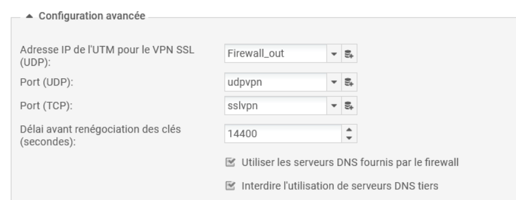

-   Sélectionner l'objet représentant l'adresse IP de L'UTM pour
    permettre un accès via le port UDP.

Il vous est aussi possible de personnaliser le laps de temps (en
secondes) au terme duquel les clés utilisées par les algorithmes de
chiffrement seront renégociées (étapes 1 et 2 de l'établissement de
tunnel). La valeur par défaut est de 4 heures (14400 secondes).

-    Scripts à exécuter sur le client

Vous pouvez sélectionner des scripts que Stormshield Network SSL VPN
Client exécutera lors de la connexion et/ou déconnexion au pare-feu
(uniquement sur Windows). Il est possible, par exemple, de
connecter/déconnecter automatiquement un lecteur réseau Windows par
cette méthode. Un exemple de script est présenté dans la section [Pour
aller plus
loin](https://documentation.stormshield.eu/SNS/v4/fr/Content/SSL_VPN_tunnels/More-Information.htm).


-    Certificats utilisés


Les certificats que doivent présenter le service VPN SSL du pare-feu et
le client pour établir un tunnel sont créés par défaut.

Si vous choisissez de créer votre propre CA, vous devez utiliser deux
certificats, et leur clé privée respective, signés par celle-ci. S'il ne
s'agit pas d'une autorité racine, les deux certificats doivent être
issus de la même sous-autorité.

Configuration des droits d'accès au VPN SSL

-   Se rendre au menu **Configuration \> Utilisateurs \> Droits
    d\'accès**, l'onglet *Accès par défaut* permet d'autoriser ou
    d'interdire l'utilisation du VPN SSL à l'ensemble des utilisateurs
    sans aucune distinction.

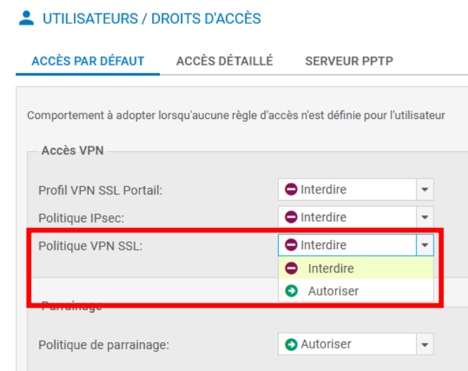

**Pour autoriser des utilisateurs spécifiques** (recommandé par
Stormshield), il faut laisser « Interdire » ici puis :

-   Cliquer sur l'onglet « Accès détaillé » et cliquer sur **Ajouter**
    afin de créer une règle d'accès personnalisée.
-   Activer la règle (colonne *Etat*), sélectionner les utilisateurs ou
    le groupe d'utilisateurs autorisés (colonne *Utilisateur -- groupe
    d'utilisateurs*) et choisir l'action **Autoriser** dans la colonne
    *VPN SSL*.

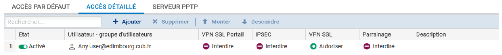

### Méthode d'authentification

**Définition des règles de filtrage pour autoriser / interdire les flux
entre les clients VPN SSL et les ressources internes**

-   Ajouter les règles nécessaires de filtrage au pare-feu comme :

-   celle autorisant n'importe quelle adresse IP sur Internet à se
    connecter sur le service VPN (1194/UDP ou 443/TCP) du pare-feu sur
    son interface externe ;


-   l'initiation de connexions à partir des clients VPN SSL et à
    destination des serveurs Web internes
-   permettre aux clients vpn d'accéder à Internet ;
-   etc.

-   Ajouter ou modifier si besoin la règle NAT permettant aux clients
    d'utiliser le VPN SSL pour accéder à internet.

!!! Info "Info"
    **Les tunnels VPN SSL sont compatibles avec les fonctions avancées de
    filtrage du pare-feu Stormshield Network. Les règles de filtrage peuvent
    donc faire appel aux profils d'inspection, proxies applicatifs, contrôle
    antiviral, etc.

!!! Info "Info"
    Pour permettre aux clients VPN SSL d'accéder au portail
    d'authentification sur les interfaces associées aux profils
    d'authentification du pare-feu, la règle de filtrage implicite nommée
    Autoriser l'accès au portail d'authentification et au VPN SSL pour les
    interfaces associées aux profils d'authentification (Authd) doit être
    activée.

Si tel n'est pas le cas, il est impératif d'ajouter des règles de
filtrage explicites dans la politique active autorisant les flux à
destination de l'interface publique sur le port d'écoute du service.

### Installation et configuration du client VPN SSL

Il est possible de configurer un client VPN sur n'importe quel système
d'exploitation. Il ne sera développé ci-après que les procédures sur
Windows et Linux.

**Pour aller plus loin au niveau des détails et de l'installation du
client sur d'autres systèmes :**
<https://documentation.stormshield.eu/SNS/v4/fr/Content/SSL_VPN_tunnels/Installation_and_configuration_of_the_client.htm>.

Sur Windows, il est possible d'utiliser le client VPN de Stormshield. Ce
client peut être téléchargé sur l'espace privé https://mystormshield.eu
et sur le portail captif du pare-feu après authentification :


**Configuration du client VPN SSL Stormshield Network**

-   Télécharger « VPN SSL client » sur le portail captif
    (https://(@IP_pare-feu \| FQDN_pare-feu)/auth).

!!! Danger "Information"
    VPN SSL Client ne peut être utilisé que sous un seul
    profil utilisateur Windows. Il doit donc être impérativement installé
    sous le profil Windows de l'utilisateur final du logiciel.

!!! Warning "Vigilence"
    D'autre part, cette installation requiert **une élévation de privilèges**.
    Si l'utilisateur ne possède pas les droits d'administration sur le poste
    de travail, il devra fournir, au cours de l'installation, le nom et le
    mot de passe d'un compte ayant les droits d'administration.

-   Faire un double clic sur l'exécutable enregistré sur le poste de
    travail.

-   Suivre les différentes fenêtres proposées par l'assistant
    d'installation. *Seuls le chemin d'installation et un groupe de
    programme à associer sont éventuellement à personnaliser.*

Le téléchargement et l'intégration des fichiers de configuration sont
réalisés automatiquement lors de l'utilisation de « Stormshield Network
SSL VPN Client ». Après authentification et validation du droit à
l'utilisation du VPN SSL, le client récupère l'ensemble des données
nécessaires pour se configurer.

-   Démarrer et paramétrer le client. Une fois démarré, le client VPN
    SSL nécessite trois paramètres :

-   l'adresse IP ou le FQDN du pare-feu à contacter :

    -   l'adresse IP ou le FQDN doit bien évidemment être accessible
        soit directement soit via une redirection ;
    -   si le port n'est pas le port par défaut (1194 en UDP et 443 en
        TCP), l'adresse IP ou le FQDN doit être suivi de
        « :numero_port »

        

    -   l'identifiant de l'utilisateur disposant des droits
        pour le VPN SSL ;

    -   Le mot de passe de l'utilisateur.

Une fenêtre indique que la connexion à ce site n'est pas sécurisée, car
le client ne fait pas confiance à la CA signataire du certificat serveur
présenté par le portail captif du pare-feu. Il est donc possible :

-   d'afficher le certificat pour savoir quelle CA l'a signé ;

-   de faire confiance à ce certificat, ce qui signifie que la CA est
    ajoutée aux autorités de confiance et qu'il est possible de
    continuer avec la configuration du tunnel ;
-   d'annuler la connexion, ce qui arrêtera la configuration du tunnel.

L'icône du client VPN SSL Stormshield qui apparaît dans la zone de
notification de la barre de tâches de Windows possède un code couleur
qui correspond à son état :

-   **Rouge :** le client est déconnecté,
-   **Jaune :** le client essaye de mettre en œuvre le tunnel,
-   **Bleu :** le client est connecté (lorsque le client est connecté, des
    informations sur la connexion apparaissent lorsque le curseur de la
    souris est positionné sur l'icône.)

La page de supervision du pare-feu permet de visualiser (et
éventuellement supprimer en déconnectant l'utiliateur) les tunnels VPN
SSL ouverts dans l'onglet **Supervision =\> tunnels VPN SSL .**


Les utilisateurs connectés via un tunnel VPN SSL sont considérés comme
authentifiés et peuvent être visualisés dans les traces.

!!! warning "Info"
    En cas d'échec de la configuration du tunnel, faire un clic droit sur
    l'icône VPN SSL Stormshield Network pour afficher les traces.

Le client VPN SSL Stormshield possède une fonction de carnet d'adresses,
qui peut aider à sauvegarder différents profils VPN dans un seul fichier
chiffré. Le mot de passe utilisé pour protéger le fichier est
spécifique. Pour ajouter une entrée au carnet d'adresses :

-   Cliquer sur le bouton « Ajouter », renseigner les détails et cliquer
    sur « OK » pour sauvegarder.

!!! warning "Info"
    Il est également possible d'importer/exporter des entrées. Le carnet
    d'adresses se trouve à l'emplacement suivant : <br/>
    %USERPROFILE%\\AppData\\Local\\Stormshield\\Stormshield SSL VPN Client\\AddrBook.gap

**Lorsque le tunnel est monté,** le poste client disposera d'une
interface spécifique au tunnel VPN SSL dont l'adresse IP fait partie de
l'objet Réseau assigné au client de la configuration serveur. Les routes
nécessaires sont automatiquement créées. Par exemple sur Linux :

```bash
route -n

Table de routage IP du noyau

Destination Passerelle Genmask Indic Metric Ref Use Iface
0.0.0.0 10.60.50.5 0.0.0.0 UG 50 0 0 tun0
10.60.50.0 10.60.50.5 255.255.255.0 UG 50 0 0 tun0
10.60.50.1 10.60.50.5 255.255.255.255 UGH 50 0 0 tun0
10.60.50.5 0.0.0.0 255.255.255.255 UH 50 0 0 tun0
10.61.50.0 10.60.50.5 255.255.255.0 UG 50 0 0 tun0
10.61.50.1 10.60.50.5 255.255.255.255 UGH 50 0 0 tun0
172.16.5.0 10.60.50.5 255.255.255.0 UG 50 0 0 tun0
192.168.5.0 10.60.50.5 255.255.255.128 UG 50 0 0 tun0
192.168.5.128 10.60.50.5 255.255.255.192 UG 50 0 0 tun0
192.168.5.192 10.60.50.5 255.255.255.192 UG 50 0 0 tun0
```

!!! Success "Résultat"
    On peut voir qu'une route par défaut est créée ⇒ Du moment que le poste est intégré au VPN toutes les communications (y compris l'accès à Internet) passe par le pare-feu Stormshield. Il est possible de modifier ce comportement mais cela n'est pas conseillé pour des raisons évidentes de sécurité.

### Configuration du client openVPN SSL sur Linux

Le fichier « openvpn_client.zip » doit être récupéré sur portail captif
de Stormshield et décompressé. Il comprend le fichier de conf du profil
(voir ci-dessous) et les certificats :

```bash
dev tun
remote 192.36.253.50 1194 udp
remote 192.36.253.50 443 tcp
cipher AES-256-CBC
tls-cipher TLS-ECDHE-RSA-WITH-AES-128-CBC-SHA256
auth SHA256
nobind
resolv-retry infinite
persist-key
persist-tun
ca \"CA.cert.pem\"
cert \"openvpnclient.cert.pem\"
key \"openvpnclient.pkey.pem\"
compress lz4
verb 0
auth-user-pass
auth-retry interact
auth-nocache
reneg-sec 0

```
Configuration sur Linux en UDP avec network-manager (seuls les éléments
modifiés sont précisés) :

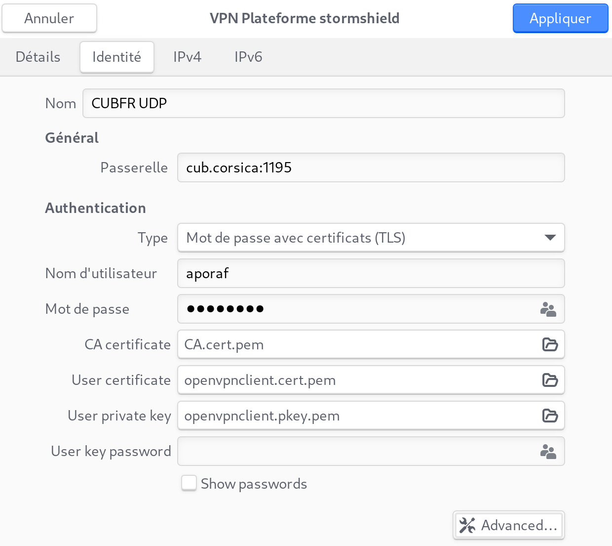

-   Se rendre au menu **Paramètres / Réseau **et cliquer sur « + » au
    niveau du VPN

-   Cliquer sur l'onglet « Identité »

Ici, le FQDN « cub.corsica » est résolu par l'adresse IP publique et le
port 1195 est redirigé vers le port UDP/1194 du pare-feu Stormshield.

-   Cliquer sur « Advanced »

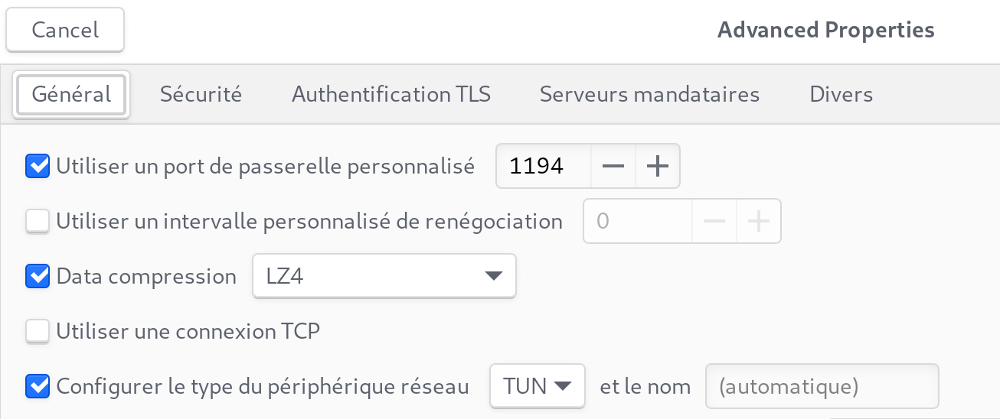

Il s'agit ici du port d'écoute en UDP du serveur VPN configuré sur le
pare-feu.


-   Cliquer sur l'onglet « Sécurité

    
-   Enregistrer en cliquant sur « Appliquer » et activer le VPN

**Configuration sur Linux en TCP **avec network-manager (seuls les
éléments modifiés sont précisés) :


-   Se rendre au menu **Paramètres / Réseau **et cliquer sur « + » au
    niveau du VPN

-   Cliquer sur l'onglet « Identité »

Ici, le FQDN « cub.corsica » est résolu par l'adresse IP publique et le
port 4435 est redirigé vers le port TCP/443 du pare-feu Stormshield.

-   Cliquer sur « Advanced »

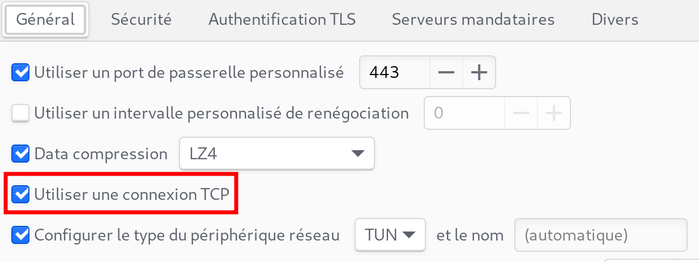

Il s'agit ici du port d'écoute en TCP du serveur VPN configuré sur le
pare-feu.

-   Cocher « Utiliser une connexion TCP » car, par défaut, le client VPN
    initie une connexion UDP »


-   Enregistrer en cliquant sur « Appliquer » et activer le VPN


## Le VPN IPSec

### Concepts et généralités

Le tunnel VPN IPsec site-à-site permet de connecter deux réseaux privés
via un réseau public tout en assurant les services de sécurité suivants :

-   l**'authentification** : permet la vérification des identités des
    deux extrémités de tunnel. Deux méthodes d'authentification sont
    possibles : clé pré-partagée (PSK : Pre-Shared key) ou certificats
    (PKI : Public Key Infrastructure) ;
-   l**'intégrité** : vérifie que les données n'ont pas été modifiées en
    utilisant les algorithmes de hachage ;
-   l**a confidentialité** : assure que les données ne peuvent être lues
    par une personne tierce capturant le trafic ;
-   l**'anti-rejeu** : permet d\'ignorer des anciens paquets (des
    paquets dont le numéro de séquence est antérieur à un certain seuil)
    déjà reçus, s\'ils sont transmis à nouveau.

La négociation du tunnel entre les deux extrémités s'effectue avec le
protocole **ISAKMP** (Internet Security Association Key Management
Protocol) appelé aussi IKE dont la dernière version se nomme IKEv2[^1].

Une fois le tunnel établi entre les deux équipements, les extrémités de
trafic correspondantes aux réseaux privés peuvent communiquer via le
protocole ESP[^2] (Encapsultating Security Payload) qui assure la
confidentialité et l'intégrité des données échangées. Le protocole ESP
est encapsulé directement dans un datagramme IP.

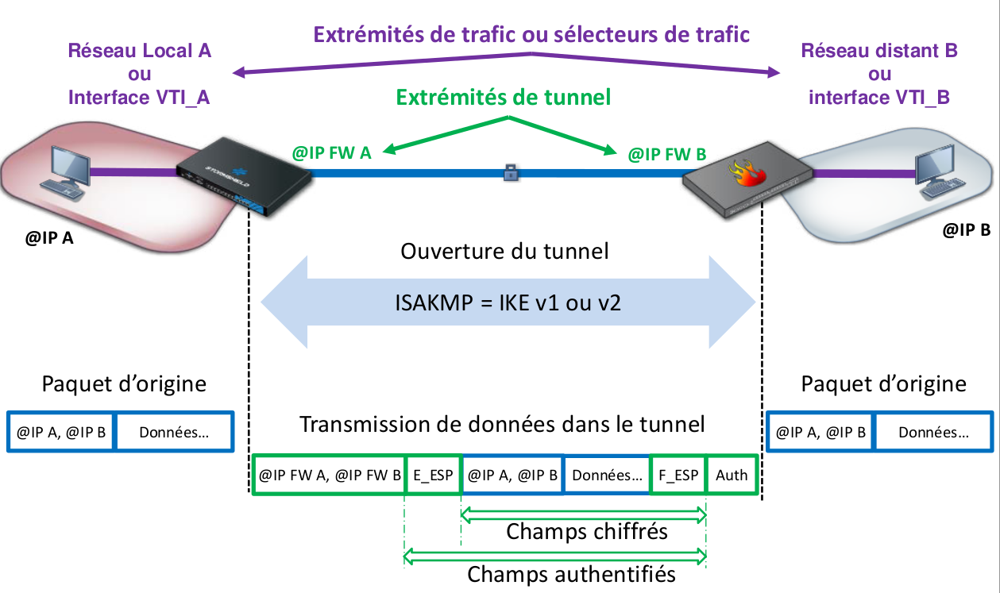

Dans le respect des bonnes pratiques, il est recommandé d'utiliser le
protocole **IKEv2** pour la mise en œuvre du tunnel et une
authentification forte par **certificats X509**.


**Phase 1 :** Les deux extrémités du tunnel négocient un profil de
chiffrement phase 1 et s'authentifient avec un clé pré-partagée ou des
certificats X509. Un dialogue d'application chiffré nommé PARENT-SA
permet ensuite de démarrer la négociation de la phase 2. Si les deux
extrémités n'arrivent pas à se mettre d'accord sur un profil de
chiffrement ou à s'authentifier, la négociation s'arrête immédiatement.

**Phase 2 :** Les deux extrémités vont négocier le profil de chiffrement
de la phase 2 et les extrémités de trafic qui permettront la
communication à travers le tunnel. Deux canaux sont ouverts pour le
transmission des données, un pour chaque direction. Chaque canal utilise
sa propre clé de chiffrement appelée CHILD-SA1 et CHILD-SA2. Chaque
extrémité possédera donc deux clés symétriques, une pour chiffrer les
données à envoyer et l'autre pour déchiffrer les données reçues dans
l'autre canal.

### Configurer le service VPN IPSec


L'authentification lors de la création d'un tunnel VPN IPSec peut se
faire de deux façons :

-   par la définition d'une clé pré-partagée commune ;
-   par l'utilisation de certificats X509 créés pour chaque extrémité à
    l'aide d'une PKI (Infrastructure à clés publiques utilisant une
    autorité de certification).

L'utilisation de la clé pré-partagée est déconseillée en production et
valable uniquement lors de phase de tests ou du maquettage. Nous
choisirons ici l'authentification par certificats.

Dans un premier temps, il est donc nécessaire de créer une PKI sur l'un
des pare-feux puis de créer des certificats serveurs pour chaque
extrémité du tunnel (ex : un certificat pour le pare-feu de edimbourg et
un certificat pour le pare-feu de frankfurt).

Cliquer sur Configuration \> Objets \> Certificats et PKI


Puis sur Ajouter \> Autorité racine

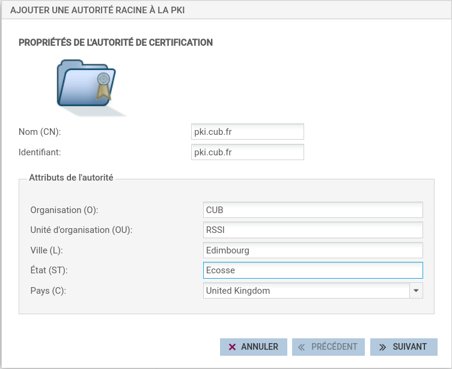


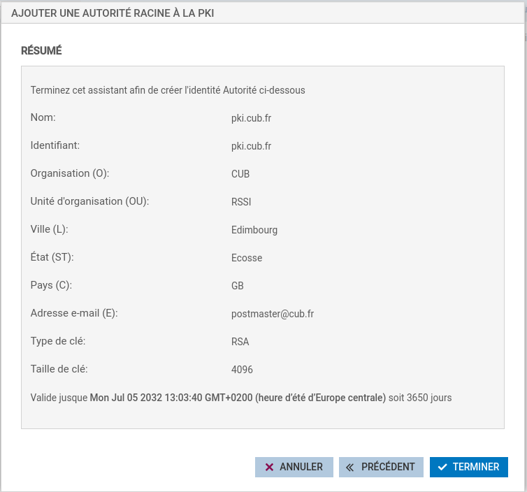

Une fois la nouvelle PKI créée, il est nécessaire de générer 2
certificats pour les 2 pare-feux concernés. Pour cela, sélectionner la
PKI pki.cub.fr et cliquer sur Ajouter \> Identité serveur afin de créer
un certificat pour le pare-feu d'Edimbourg.


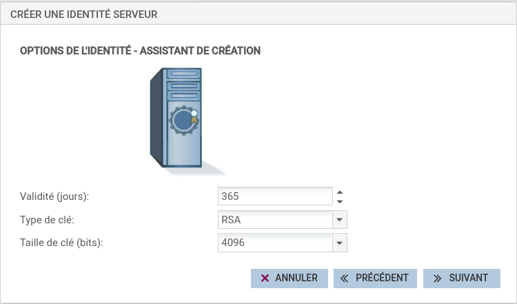


Il faut ensuite réaliser la même opération afin de créer un certificat
pour le pare-feu de Frankfurt en adaptant certains paramètres dont en
particulier le CN (Common Name) du certificat.

Nous avons maintenant à notre disposition une PKI et 2 certificats
générés.

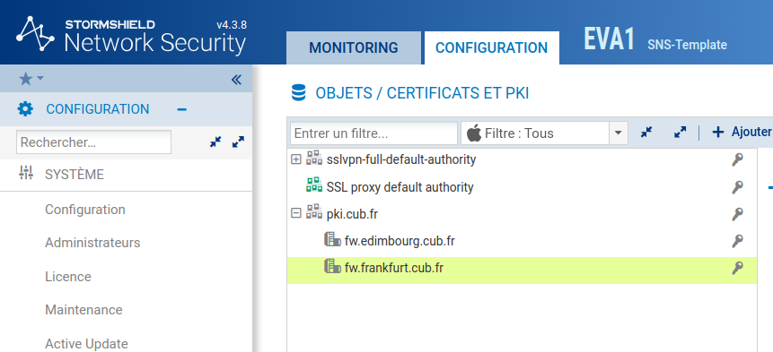

Comme la PKI a été créée sur le pare-feu d'Edimbourg, il est nécessaire
d'exporter le certificat du pare-feu de Frankfurt sur le pare-feu de
l'agence de Frankfurt.

Pour cela, clique droit sur le certificat concerné puis Télécharger \>
Identité \> au **format P12**. Il est demandé d'entrer un mot de passe qui
permettra de protéger votre clé privée en particulier en cas de vol ou
de compromission.

??? Info "Format P12"
    Certificat **P12** (PKCS#12)<br/>
    - **Encodage** : Le format **P12** est encodé en **binaire**.<br/>
    - **Structure** : C'est un conteneur binaire qui peut stocker à la fois des certificats, des clés privées et même des chaînes de certificats (certificats intermédiaires et racine).<br/>
    - **Utilisation** : Le format **P12** est utilisé pour transporter à la fois un certificat et sa clé privée dans un seul fichier, souvent pour les besoins d'import/export (ex. : sur les navigateurs, serveurs ou clients).<br/>
    - **Extension de fichier** : Les fichiers **P12** ont souvent l'extension `.p12` ou `.pfx`.<br/>
    - **Sécurité** : Le fichier **P12** peut être protégé par un mot de passe pour sécuriser les clés privées qu'il contient.<br/>
    - **Lisibilité** : Non lisible en texte brut, car c'est un fichier binaire. Il doit être ouvert avec des outils spécialisés (comme `OpenSSL` ou les gestionnaires de certificats dans les systèmes d'exploitation).

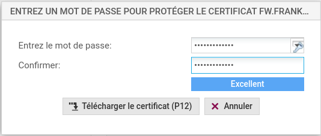


Une fois le fichier p12 téléchargé sur le poste, il est nécessaire de
l'importer dans l'autre pare-feu en l'occurence celui de Franckfurt.
Pour cela, se connecter sur l'interface d'administration du pare-feu
concerné en s'assurant de disposer du fichier p12 sur le poste client
d'administration.

Puis cliquer sur Configuration \> Objets \> Certificats et PKI puis sur
Ajouter \> Importer un fichier.

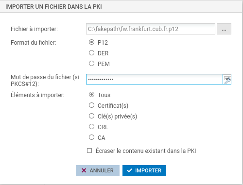

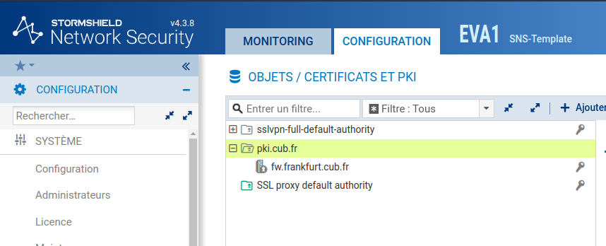

### Configuration du VPN IPSEC

Maintenant que chaque pare-feu dispose de son certificat signé par la
PKI précédemment créée, il s'agit de configurer le tunnel VPN IPSEC sur
les deux extrémités.

Sur le pare-feu de Edimbourg, cliquer sur Configuration \> VPN \> VPN
IPsec et choisir la politique IPsec 04 (04) qu'il faudra renommer
IPsec-EdFk.


Puis cliquer sur Ajouter \> Tunnel site à site simple.

Un assistant s'ouvre et permet de définir quel sous-réseau ou VLAN de
votre agence (ici Edimbourg) pourra envoyer et recevoir des flux par le
tunnel VPN IPSec jusqu'à l'autre agence (ici Frankfurt). Ainsi, en
ressources locales, indiquer le sous-réseau ou le VLAN présent dans
votre agence (si vous souhaitez permettre la communication de plusieurs
sous-réseaux, il faut au préalable créer un objet groupe contenant
l'ensemble des sous-réseaux concernés).

En réseaux distants, vous indiquerez un objet réseau correspondant au
sous-réseau à joindre dans l'autre agence. Enfin, il sera indispensable
de définir un correspondant et de le sélectionner.

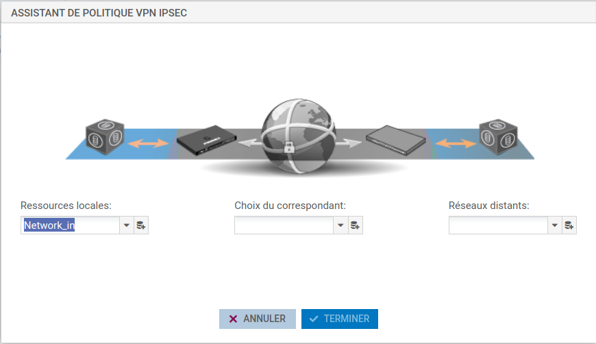

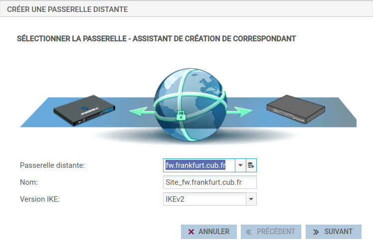

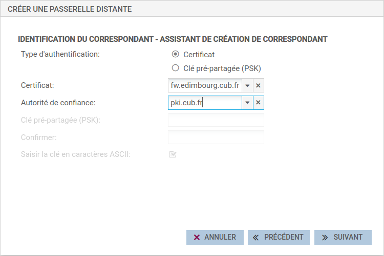

!!! Warning "Attention"
    **Attention ! Cette étape peut porter à confusion**. Bien que le terme
    « identification du correspondant » soit employé ici, c'est bien le
    certificat du pare-feu sur lequel vous êtes connecté (ici pare-feu
    Edimbourg) qu'il faut indiquer et non celui du pare-feu distant.


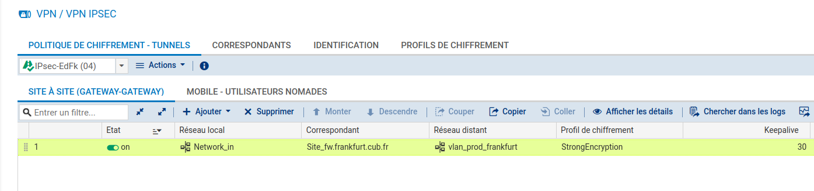

Lorsque la création du tunnel IPSec est effective, il faut bien
évidemment l'activer (on) **et définir une valeur en seconde de
Keepalive (vous veillerez à définir la même valeur sur le pare-feu
distant, ici, Frankfurt)**. Cela permettra de faciliter l'activation du
tunnel et assurera le maintien de ce dernier même en cas d'absence de
trafic à l'intérieur de celui-ci (lire l'explication ci-dessous).

!!! Info "KeepAlive"
    L'option supplémentaire **Keepalive** permet de maintenir les
    tunnels montés de façon artificielle. Cette mécanique envoie des paquets
    initialisant et forçant le maintien du tunnel. Cette option est
    désactivée par défaut pour éviter une charge inutile, dans le cas de
    configuration contenant de nombreux tunnels, montés en même temps sans
    réel besoin.

**Pour activer cette option**, affectez une valeur suppérieur à  0,
correspondant à l'intervalle en seconde, entre chaque envoi de paquet
UDP.

### Mise en œuvre des règles de filtrage adaptées

Pour que la communication par l'intermédiaire de ce tunnel IPsec soit
pleinement fonctionnel, il est nécessaire de créer les règles de
filtrage permettant d'autoriser la création du VPN puis la communication
entre les sous-réseaux distants.

Toujours sur le pare-feu de l'agence d'Edimbourg, il faut autoriser
l'établissement du tunnel (protocoles ISAKMP et ESP) entre les deux
pare-feux. Normalement, une règle implicite est prévue à cet effet,
cependant lors de différentes phases de test, cela s'est avéré peu
concluant, ce qui nous amène à proposer des règles explicites à ce
sujet.


Enfin, il faut définir les règles nécessaires autorisant la
communication des sous-réseaux définis dans la configuration du tunnel
au niveau des règles de filtrage.


La directive « via Tunnel VPN IPsec » dans la seconde règle est très
importante et obligatoire. Il est possible de la définir lors de la
création de la règle dans le menu Source \> Configuration avancée \>
Via : Tunnel VPN IPSec.

À partir de là, **il s'agira de réaliser exactement les mêmes opérations
dans le sens inverse sur le pare-feu de l'autre agence (ici Frankfurt)**
afin de rendre le tunnel pleinement opérationnel.

!!! Danger "Nota Bene"
    **NB :** La plupart des erreurs rencontrées proviennent de différences
    de configuration entre les deux extrémités du tunnel (Profil de
    chiffrement utilisé, Keepalive, définition des sous-réseaux habilités à
    solliciter le tunnel VPN, etc). Il s'agit donc de faire preuve de
    rigueur et d'attention sur ces éléments en particulier.